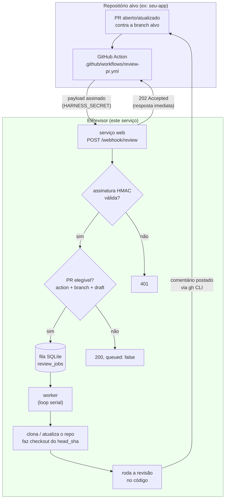

# ElRevisor

Harness de revisão automatizada de pull requests. Roda como um serviço próprio
(fora do repositório que está sendo revisado) e é acionado por uma GitHub
Action leve que você cola no(s) repositório(s) alvo. Quando um PR abre ou
atualiza, o harness clona o código, roda a revisão e comenta o resultado
direto no PR.

Este documento cobre duas coisas separadas:

1. Como subir o harness (esta aplicação).
2. **Como configurar um repositório alvo** para que os PRs dele passem a ser
   revisados — é a parte que você precisa repetir em cada repositório que
   quiser cobrir.

## Como funciona



Passo a passo:

1. Alguém abre, reabre ou atualiza (`synchronize`) um PR contra a branch alvo
   no repositório monitorado.
2. A GitHub Action (`review-pr.yml`) monta um payload com os dados do PR,
   assina com HMAC-SHA256 usando um segredo compartilhado e faz um `curl`
   para o harness. Ela **não espera** o resultado — só entrega o aviso.
3. O harness valida a assinatura, decide se o PR é elegível (branch certa,
   não é draft, ação permitida) e coloca o job numa fila SQLite. Responde
   `202 Accepted` na hora.
4. Um worker separado processa a fila **em série** (nunca dois PRs ao mesmo
   tempo, nem de repositórios diferentes): clona (ou atualiza) o repositório
   num workspace persistente, faz checkout exato do commit do PR, roda a
   revisão e posta o resultado como comentário no PR usando o `gh` CLI.

## Subindo o harness

```bash
cp .env.example .env
# preencha HARNESS_SECRET, GH_TOKEN e as credenciais da ferramenta de revisão
docker compose build
docker compose up -d
```

Variáveis principais do `.env` (veja `.env.example` para a lista completa):

| Variável | Para que serve |
|---|---|
| `HARNESS_SECRET` | Segredo HMAC compartilhado com a GitHub Action do repo alvo |
| `TARGET_BRANCH` | Branch considerada elegível para review (ex: `main`) |
| `ALLOW_DRAFTS` | Se `true`, PRs em draft também entram na fila |
| `GH_TOKEN` | Token com leitura de código + escrita de comentário em PR nos repositórios alvo |
| `ANTHROPIC_API_KEY` / `CLAUDE_CREDENTIALS_DIR` | Credencial da ferramenta de revisão automatizada (uma das duas) |

O harness expõe `GET /health` para checagem de vida.

## Configurando um repositório alvo

Isto é o que precisa ser feito **em cada repositório que vai ser revisado**
pelo ElRevisor:

1. **Copie o template do workflow** de `templates/github-workflow/review-pr.yml`
   deste repositório para `.github/workflows/review-pr.yml` no repositório
   alvo.

2. **Configure dois secrets** em *Settings → Secrets and variables → Actions*
   do repositório alvo:
   - `HARNESS_URL` — URL pública onde o harness está rodando (ex:
     `https://revisor.seudominio.com`)
   - `HARNESS_SECRET` — o **mesmo valor** configurado no `.env` do harness

3. **Confira a branch alvo.** O workflow copiado dispara para PRs contra
   `main` por padrão (`branches: [main]` no gatilho do workflow). Se o
   repositório usa outra branch principal, ajuste tanto o workflow quanto o
   `TARGET_BRANCH` no `.env` do harness para o mesmo valor — os dois
   precisam bater, porque o harness também confere a branch antes de
   enfileirar.

4. **Garanta que o `GH_TOKEN` do harness tem acesso a esse repositório**
   (leitura de código + permissão de comentar em PR). Sem isso o worker
   consegue enfileirar o job, mas falha ao clonar ou ao comentar.

5. Pronto. Da próxima vez que alguém abrir ou atualizar um PR contra a
   branch alvo (e ele não estiver em draft, a menos que `ALLOW_DRAFTS=true`),
   a revisão roda automaticamente.

### O que acontece se algo não estiver configurado certo

- **Secret errado ou ausente**: o harness responde `401` e nada é
  enfileirado — confira se `HARNESS_SECRET` é idêntico dos dois lados.
- **Branch não bate**: o harness responde `200` com `queued: false` e um
  motivo (`base_ref '...' is not the target branch '...'`) — não é erro,
  é o filtro de elegibilidade funcionando.
- **PR em draft**: mesma coisa, `queued: false` com motivo `draft PRs are
  not reviewed`, a menos que `ALLOW_DRAFTS=true` no harness.
- **Job falha depois de enfileirado** (clone ou comentário): fica marcado
  como `failed` na fila SQLite com o erro registrado — geralmente é
  permissão do `GH_TOKEN` no repositório alvo.

## Notas de operação

- A fila é **serial por design**: só um job processa por vez, mesmo que
  vários PRs de repositórios diferentes cheguem juntos. Eles esperam a vez.
- O clone de cada repositório é persistente (fica num workspace próprio,
  reaproveitado entre revisões) — não é um clone novo a cada PR.
